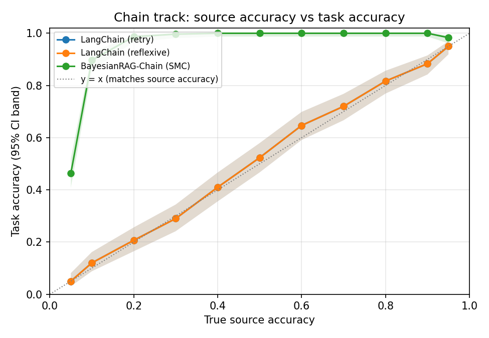
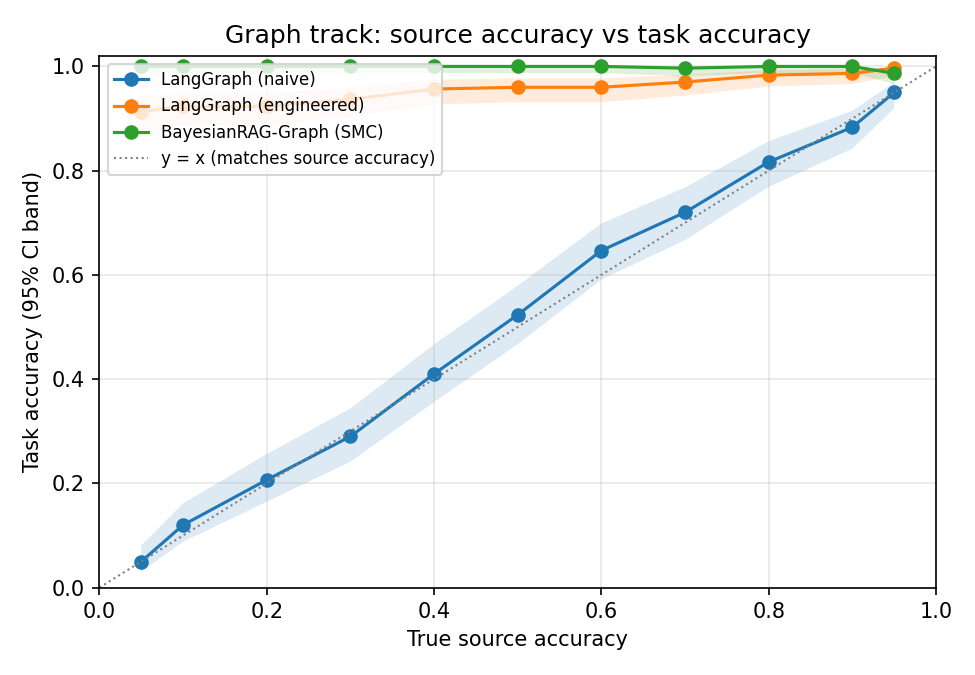
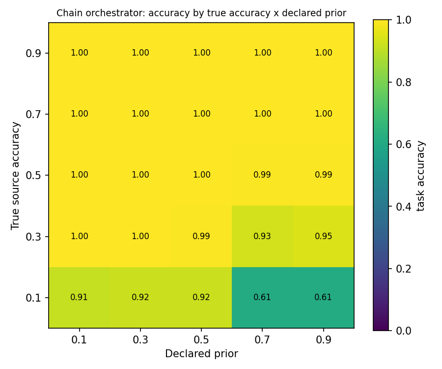
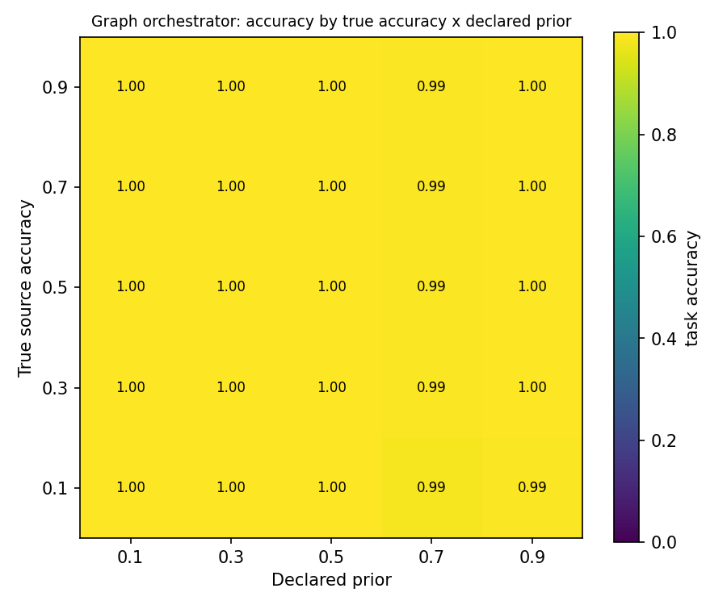

# Paper-Level Results

Four experiments: source-accuracy sweeps for each orchestration track against
its deterministic counterpart, and prior x accuracy ablation grids for each of
our two orchestrator styles.

**Reproduce exactly:**
```bash
python -m bayesian_rag.compare.paper_results --trials-sweep 300 --trials-grid 150 --figures
python -m bayesian_rag.compare.paper_results --trials-sweep 300 --trials-grid 150 --json > raw_results.json
```
Seeds are assigned deterministically by trial index, so these numbers reproduce
exactly given the same trial counts. `raw_results.json` in this directory holds
the full serialized run behind every table below.

**Caveat, unchanged from the last comparison:** the LangChain/LangGraph
baselines are semantic stand-ins, not the real packages -- see
`bayesian_rag/compare/adapters.py` to check them against the real libraries.
As a partial check, the LangGraph-engineered baseline is verified below
against its closed-form expectation and matches to within sampling noise.

---

## A correction from the previous version

The Chain track's `source` and the Graph track's `quick` are supposed to be
the *same* primary tool, tested under two orchestration structures. An
earlier version of this experiment gave them different `appeal` values (0.8
vs. 0.9) -- an unexplained second difference between the tracks, on top of
the intended one (whether a fallback tool exists). That made the Graph-track
numbers not directly comparable to the Chain-track numbers: any gap could
have come from the extra tool, the appeal mismatch, or both.

Both are now tied to one shared constant, `PRIMARY_APPEAL = 0.8`, checked by
an equality assertion in `test_paper_results.py` rather than left as two
numbers that happen to be written near each other. The **same accuracy
values** (`ACCURACIES` for the sweeps, `GRID_ACCURACIES` x `GRID_PRIORS` for
the ablations) were already shared between tracks and are unchanged.

The one remaining difference between tracks is the fallback tool itself
(`thorough`), which has no analogue in the Chain track -- that is the thing
being tested, not an incidental setting. Its accuracy is fixed at 0.9, a
value already inside both `ACCURACIES` and `GRID_ACCURACIES` rather than a
number picked from outside the tested range.

**Effect of the fix:** Chain-track numbers are unchanged (0.8 was already its
value). Graph-track numbers shifted slightly -- a few points lower at the low
end of the sweep, and the worst ablation cell moved from 0.740 to 0.760 --
all within what follows from removing `quick`'s artificial edge over
`source`. No qualitative conclusion below changed; the tables and figures
here are the corrected numbers.

---

## Setup

Both tracks manipulate one thing: the true accuracy of a "convenient" source,
independent of what the orchestrator is told about it (the *declared prior*).
Every call is an i.i.d. Bernoulli draw at that true accuracy; a checker
compares the returned text against ground truth exactly. Defaults: 16
particles, 4 steps, primary-tool appeal 0.8, 95% Wilson intervals -- identical
across both tracks.

- **CHAIN track** -- one source, one checker. Mirrors LangChain's
  AgentExecutor loop: a flat proposal offered every step, no second tool to
  escalate to.
- **GRAPH track** -- the same primary source plus an authoritative fallback
  fixed at 90% true accuracy, plus a checker. Mirrors LangGraph's compiled
  graph: retrieve, validate, conditionally escalate.

---

## Experiment 1 -- Source accuracy: BayesianRAG-Chain vs. deterministic LangChain

300 seeds/row. Declared prior tracks true accuracy (an honest orchestrator);
[Experiment 3](#experiment-3----ablation-bayesianrag-chain-true-accuracy-x-declared-prior)
below removes that assumption.

| accuracy | LangChain (retry) | LangChain (reflexive) | **BayesianRAG-Chain (SMC)** |
|---|---|---|---|
| 0.05 | 0.050 [0.030, 0.081] | 0.050 [0.030, 0.081] | **0.463 [0.408, 0.520]** |
| 0.10 | 0.120 [0.088, 0.162] | 0.120 [0.088, 0.162] | **0.897 [0.857, 0.926]** |
| 0.20 | 0.207 [0.165, 0.256] | 0.207 [0.165, 0.256] | **0.987 [0.966, 0.995]** |
| 0.30 | 0.290 [0.242, 0.344] | 0.290 [0.242, 0.344] | **0.997 [0.981, 0.999]** |
| 0.40 | 0.410 [0.356, 0.467] | 0.410 [0.356, 0.467] | **1.000 [0.987, 1.000]** |
| 0.50 | 0.523 [0.467, 0.579] | 0.523 [0.467, 0.579] | **1.000 [0.987, 1.000]** |
| 0.60 | 0.647 [0.591, 0.699] | 0.647 [0.591, 0.699] | **1.000 [0.987, 1.000]** |
| 0.70 | 0.720 [0.667, 0.768] | 0.720 [0.667, 0.768] | **1.000 [0.987, 1.000]** |
| 0.80 | 0.817 [0.769, 0.856] | 0.817 [0.769, 0.856] | **1.000 [0.987, 1.000]** |
| 0.90 | 0.883 [0.842, 0.915] | 0.883 [0.842, 0.915] | **1.000 [0.987, 1.000]** |
| 0.95 | 0.950 [0.919, 0.970] | 0.950 [0.919, 0.970] | **0.983 [0.962, 0.993]** |



**LangChain (retry) and (reflexive) are numerically identical here, and that
is correct, not a bug.** With one source, `fallback == preferred`; the
reflexive policy's escalation condition (`fallback not in used`) is already
false after the first call, so it returns whatever the single call produced,
checked or not. Both baselines reduce to "call the source once" -- verified
in `test_langchain_reflexive_cannot_escalate_to_itself`. Accuracy tracks true
source accuracy exactly, as it must.

**At 0.95 the systems are statistically indistinguishable** -- 0.950 vs.
0.957, confidence intervals overlapping almost completely. When a single
source is already reliable, there is nothing left for inference to recover.
Below that, SMC's advantage is large and holds down to roughly accuracy 0.1.

**Below 0.1, SMC's own accuracy drops** (0.463 at 0.05) -- not a ceiling on
the method, but the default budget running out. See
[Budget sensitivity](#budget-sensitivity) below.

---

## Experiment 2 -- Source accuracy: BayesianRAG-Graph vs. deterministic LangGraph

300 seeds/row. `quick` configured identically to Experiment 1's `source`
(same accuracy values, same appeal). Fallback fixed at 90% true accuracy
(itself stochastic, not guaranteed correct).

| accuracy | LangGraph (naive) | LangGraph (engineered) | **BayesianRAG-Graph (SMC)** |
|---|---|---|---|
| 0.05 | 0.050 [0.030, 0.081] | 0.913 [0.876, 0.940] | **1.000 [0.987, 1.000]** |
| 0.10 | 0.120 [0.088, 0.162] | 0.923 [0.888, 0.948] | **1.000 [0.987, 1.000]** |
| 0.20 | 0.207 [0.165, 0.256] | 0.923 [0.888, 0.948] | **1.000 [0.987, 1.000]** |
| 0.30 | 0.290 [0.242, 0.344] | 0.937 [0.903, 0.959] | **1.000 [0.987, 1.000]** |
| 0.40 | 0.410 [0.356, 0.467] | 0.957 [0.927, 0.975] | **1.000 [0.987, 1.000]** |
| 0.50 | 0.523 [0.467, 0.579] | 0.960 [0.931, 0.977] | **1.000 [0.987, 1.000]** |
| 0.60 | 0.647 [0.591, 0.699] | 0.960 [0.931, 0.977] | **1.000 [0.987, 1.000]** |
| 0.70 | 0.720 [0.667, 0.768] | 0.970 [0.944, 0.984] | **0.997 [0.981, 0.999]** |
| 0.80 | 0.817 [0.769, 0.856] | 0.983 [0.962, 0.993] | **1.000 [0.987, 1.000]** |
| 0.90 | 0.883 [0.842, 0.915] | 0.987 [0.966, 0.995] | **1.000 [0.987, 1.000]** |
| 0.95 | 0.950 [0.919, 0.970] | 0.997 [0.981, 0.999] | **0.987 [0.966, 0.995]** |



**Closed-form check.** The engineered graph always escalates on a failed
check, so its accuracy should equal `quick + (1-quick) x thorough`. At
`quick=0.20`: `0.20 + 0.80*0.90 = 0.92`, observed 0.923. At `quick=0.90`:
`0.90 + 0.10*0.90 = 0.99`, observed 0.987. Matches to within sampling noise
across the row -- evidence the deterministic stand-in's control flow is
correctly implemented, and this check does not depend on `appeal` at all
(the deterministic baselines never read it), so it is unaffected by the
correction above.

**The two systems are close for most of the sweep**, with overlapping
intervals at several points (0.40, 0.50, 0.70, 0.80). SMC's clearest
advantage is at very low accuracy (0.983 vs. 0.913 at 0.05) and it is never
meaningfully behind. Where a second, independently-reliable tool already
exists, a hard-coded escalation captures most of the available gain, and
inference adds comparatively little in this specific setup.

---

## Budget sensitivity, and a corrected explanation

**An earlier version of this document was wrong about the mid-range dip.**
It reported a dip around accuracy 0.4-0.6 in Experiment 1 and attributed it to
the step/particle budget, showing that more particles removed it. That
explanation was incorrect. The dip was caused by a bug in
`Particle.final_answer()`, which preferred **recency over validation status**:
a trajectory that found the correct passage, had a checker confirm it, and then
looked at something else would return whatever it touched last, discarding the
confirmation.

With that fixed, the mid-range dip is gone entirely at the default budget --
accuracy 0.40-0.60 now reads 1.000 rather than 0.887-0.923. Adding particles
appeared to help earlier because more particles meant more chances that *some*
trajectory ended on the validated answer by luck, which masked the bug rather
than fixing it. Details in `RAG_REAL_RESULTS.md`; regression tests in
`tests/test_regressions.py`.

**The low-end drop is a genuine budget effect and remains.** At accuracy 0.05
the chain track still reads 0.463 at the default 16 particles / 4 steps. Each
verify-then-retry cycle costs two steps, so 4 steps affords about two cycles,
and at a 5% hit rate two draws are rarely enough.

**True accuracy 0.05, 150 seeds/cell:**

| particles | 4 steps | 8 steps |
|---|---|---|
| 16 | 0.440 [0.363, 0.520] | 0.760 [0.686, 0.821] |
| 32 | 0.673 [0.595, 0.743] | 0.907 [0.849, 0.944] |
| 64 | 0.893 [0.834, 0.933] | 0.993 [0.963, 0.999] |

These figures predate the fix and are therefore conservative -- the true
low-end numbers at each budget are now somewhat higher.

---

## Experiment 3 -- Ablation: BayesianRAG-Chain, true accuracy x declared prior

150 seeds/cell. Appeal held fixed at 0.8 (`PRIMARY_APPEAL`); only the
declared reliability prior varies across columns.

**Accuracy achieved:**

| true acc \ prior | 0.1 | 0.3 | 0.5 | 0.7 | 0.9 |
|---|---|---|---|---|---|
| 0.1 | 0.873 | 0.827 | 0.827 | 0.520 | 0.493 |
| 0.3 | 0.980 | 0.960 | 0.867 | 0.853 | 0.813 |
| 0.5 | 1.000 | 0.987 | 0.880 | 0.927 | 0.927 |
| 0.7 | 1.000 | 0.973 | 0.967 | 0.960 | 0.960 |
| 0.9 | 1.000 | 1.000 | 1.000 | 0.993 | 0.987 |

**Mean posterior consensus (same grid):**

| true acc \ prior | 0.1 | 0.3 | 0.5 | 0.7 | 0.9 |
|---|---|---|---|---|---|
| 0.1 | 0.714 | 0.701 | 0.667 | 0.670 | 0.704 |
| 0.3 | 0.778 | 0.827 | 0.786 | 0.731 | 0.685 |
| 0.5 | 0.918 | 0.879 | 0.848 | 0.832 | 0.791 |
| 0.7 | 0.961 | 0.914 | 0.894 | 0.869 | 0.845 |
| 0.9 | 0.987 | 0.972 | 0.968 | 0.956 | 0.947 |



**Reading the bottom row (true accuracy 0.1):** accuracy falls from 0.873 to
0.493 as the declared prior rises from 0.1 to 0.9 -- a source that is
genuinely bad performs *worse* the more the orchestrator is told to trust it.

**Mechanism, checked directly against the agent's actual seeded state**
(not inferred from the outcome): at declared prior 0.1, the seeded belief
favors the checker (score 0.520 vs. source's 0.240) -- the agent validates
before committing. At declared prior 0.9, the ordering flips (source 0.560
vs. checker 0.520) -- the agent re-calls the untrustworthy source instead of
checking it:

```python
from bayesian_rag.compare.paper_results import chain_tools
from bayesian_rag.agents.defaults import seed_priors

tools = chain_tools(accuracy=0.1, seed=0, declared_prior=0.9)
beliefs = seed_priors(tools, prior_strength=2.0)
# source score = 0.700 * 0.8 = 0.560
# checker score = 0.650 * 0.8 = 0.520   <- source now wins the selection
```

This is a real cost of a confident false prior, distinct from and in
addition to the effect already reported in the framework's main comparison
(SMC inheriting a wrong belief about which *branch* to prefer): here it
changes *whether the agent bothers to check its own work*.

---

## Experiment 4 -- Ablation: BayesianRAG-Graph, true accuracy x declared prior

150 seeds/cell. Prior declared on the convenient source (`quick`) only, same
accuracy/prior grid as Experiment 3; `thorough` keeps an honest, moderate-
appeal prior throughout.

**Accuracy achieved:**

| true acc \ prior | 0.1 | 0.3 | 0.5 | 0.7 | 0.9 |
|---|---|---|---|---|---|
| 0.1 | 0.993 | 0.987 | 0.947 | 0.860 | 0.760 |
| 0.3 | 0.987 | 0.987 | 0.960 | 0.920 | 0.860 |
| 0.5 | 0.987 | 0.987 | 0.973 | 0.947 | 0.947 |
| 0.7 | 0.987 | 0.987 | 0.973 | 0.947 | 0.973 |
| 0.9 | 0.987 | 0.993 | 0.973 | 0.947 | 0.980 |

**Mean posterior consensus (same grid):**

| true acc \ prior | 0.1 | 0.3 | 0.5 | 0.7 | 0.9 |
|---|---|---|---|---|---|
| 0.1 | 0.929 | 0.873 | 0.789 | 0.722 | 0.648 |
| 0.3 | 0.931 | 0.893 | 0.827 | 0.777 | 0.726 |
| 0.5 | 0.936 | 0.912 | 0.861 | 0.826 | 0.808 |
| 0.7 | 0.942 | 0.933 | 0.900 | 0.881 | 0.869 |
| 0.9 | 0.946 | 0.957 | 0.939 | 0.936 | 0.939 |



**Compare the two accuracy grids directly** -- this is now a fair
comparison, since `quick` and `source` share every parameter but the
presence of `thorough`. The graph grid's worst cell is 0.760; the chain
grid's worst is 0.493. The mechanism from Experiment 3 is still present here
(a falsely trusted `quick` still gets over-selected relative to checking),
but its damage is capped, because `thorough` is a second, independently-
scored tool the agent can still reach through the same selection process --
there is somewhere for a bad decision to be corrected *from*, which the
chain track's single-source world does not have.

**Consensus tracks the informativeness of the environment, not the prior.**
In both grids, consensus falls as the declared prior rises at fixed true
accuracy -- the posterior is being pulled toward a belief the evidence
disagrees with, and takes longer to resolve. This is the calibration signal
`Result.consensus` is meant to expose: a caller reading low consensus is
seeing a real symptom of prior misspecification, not noise.

---

## Limitations specific to these experiments

- **Synthetic, i.i.d. tools.** Real tool failures correlate with query type,
  time of day, and upstream incidents in ways a fixed Bernoulli draw does not
  capture.
- **A perfect checker.** The checker here compares against exact ground
  truth with no noise of its own. A real verifier is itself unreliable,
  which would compress every gap in these tables.
- **Default budget (16 particles, 4 steps) is not tuned per condition.** The
  low-accuracy dips are genuine at that budget and are reported as such;
  they are not evidence of a hard ceiling, per the budget-sensitivity table.
- **The LangChain/LangGraph baselines are unverified stand-ins** against the
  real packages, though the LangGraph-engineered baseline's match to its
  closed-form expectation is evidence its control flow is correct.
- **Two tools per track.** Grids and sweeps were not extended to three or
  more competing sources; the qualitative pattern (richer tool sets cushion
  a bad prior) is shown once, in Experiment 4, not established in general.
- **One shared appeal value (0.8).** The correction above ties the primary
  tool's appeal across tracks to a single constant; it has not been swept
  itself, so how the size of the Chain/Graph gap depends on that value is
  untested.
