# 1. Overview

BayesianRAG is a Python framework that replaces hard-coded agent control flow
with sequential Monte Carlo (SMC) inference over trajectories. A trajectory is
a sequence of (tool call, observation) pairs; the framework maintains a
population of candidate trajectories, samples actions from a belief-weighted
policy, resolves evidence retroactively against the tool that produced it, and
reweights the population by how well each trajectory's evidence holds up. The
same tool set and code path run under three interchangeable inference
regimes — `greedy`, `forward`, `smc` — selected by a single constructor
argument, which is what makes every comparison in this document controlled.

This document is organized as a procedural reference, not a narrative: §2
gives the architecture, §3 the algorithm, §4 the public API, §5 the
experimental protocol, §6 the complete results (main benchmark, unreliable
agents, prior sensitivity, deterministic-baseline comparison, and three RAG
case studies), §7 the engineering defects found during development, §8
reproduction instructions, §9 scope and limitations, and §10 repository and
archive information.

# 2. System architecture

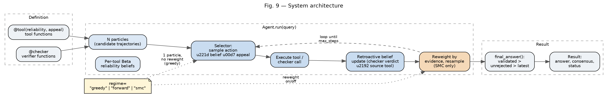

The framework has four layers:

1. **Tool layer.** Plain Python functions decorated `@tool(reliability, appeal)`
   or `@checker`. `reliability` is the tool's declared prior accuracy;
   `appeal` is a separate, independent number controlling how tempting the
   tool looks to the selector before evidence arrives. Separating the two is
   the load-bearing design decision: the primary failure mode this framework
   targets is a tool that is attractive but wrong, and appeal/reliability
   conflation would make that failure mode inexpressible.
2. **Particle layer.** An `Agent.run(query)` call initializes N particles,
   each carrying its own trajectory (action/observation history) and its own
   copy of per-tool Beta(α, β) reliability beliefs.
3. **Inference layer.** At each step, up to `max_steps`, every particle's
   selector samples an action with probability proportional to
   `belief_mean × appeal` over available tools plus, once a claim exists, the
   checker. The tool executes; if it is a checker, its verdict updates the
   Beta belief of the tool that produced the checked claim — not the checker
   itself. Under `regime="smc"`, particles are then reweighted by evidence
   likelihood and resampled when the effective sample size degenerates.
4. **Decision layer.** `final_answer()` selects, in order: an answer a
   checker in this trajectory explicitly validated; the most recent answer no
   checker rejected; the most recent answer at all. Posterior `consensus` is
   the fraction of particles agreeing with the returned answer.

## 2.1 Inference regimes

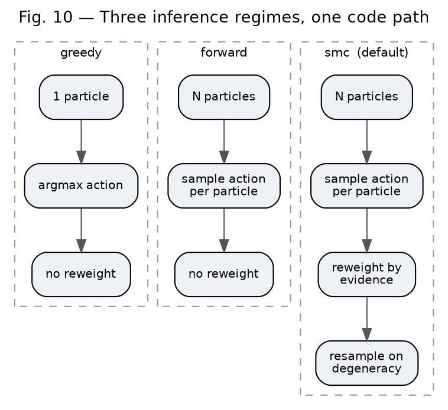

| Regime | Particles | Samples actions | Reweights | Revises earlier decisions |
|---|---|---|---|---|
| `greedy` | 1 | no (argmax) | no | no |
| `forward` | N | yes | no | no |
| `smc` (default) | N | yes | yes | **yes** |

Because the regime is a single argument and every other component is shared,
the comparisons in §6 isolate the effect of inference strategy from the
effect of tool set or code path.

# 3. Algorithm

```
Agent.run(query):
    particles ← N copies of (trajectory=[], beliefs=prior Beta(1,1) per tool)
    for step in 1..max_steps:
        for p in particles:
            candidates ← available tools, plus checker if p.trajectory has a claim
            weights ← [belief_mean(p, t) × appeal(t) for t in candidates]
            action ← sample(candidates, weights)              # argmax if greedy
            observation ← execute(action)
            p.trajectory.append((action, observation))
            if action is a checker:
                update_belief(p, source_tool_of(observation.claim), observation.verdict)
        if regime == "smc":
            w ← evidence_likelihood(p) for each p
            particles ← resample(particles, w) if ESS(w) < threshold
    answer ← consensus_vote(p.final_answer() for p in particles)
    return Result(answer, consensus, status)
```

Two mechanisms are structural, not incidental:

- **Retroactive belief update.** A checker's verdict updates the Beta belief
  of the tool that *produced* the checked claim, evaluated per particle at
  execution time rather than baked from a single shared claim menu (bug 3,
  §7).
- **`final_answer()` ordering.** Validated beats unrejected beats latest
  (bug 9, §7). This single ordering choice moved measured results throughout
  §6 by 15–40 points and is the largest-impact defect found in this project.

# 4. Public API

```python
from bayesian_rag import Agent, tool, checker

@tool(reliability=0.6, appeal=0.9)      # attractive, mediocre
def quick_search(query: str) -> str: ...

@tool(reliability=0.9, appeal=0.4)      # unappealing, trustworthy
def verified_search(query: str) -> str: ...

@checker
def validate(text: str) -> bool: ...

result = Agent(
    [quick_search, verified_search, validate],
    regime="smc",          # or "greedy" / "forward"
    particles=16,
    max_steps=4,
    seed=0,
).run("What is the current price?")

result.answer, result.consensus, result.status
```

No graph wiring, no callbacks, no custom control flow. `regime` is the only
argument that changes between the three inference strategies compared below.

# 5. Experimental protocol

- **Seeding.** Every trial is fully seeded; all reported figures are
  reproducible bit-for-bit from the seed alone.
- **Intervals.** Proportions are reported with 95% Wilson score intervals
  (closed-form, no continuity correction needed at these sample sizes).
  Paired differences use two-proportion tests or Newcombe intervals as noted.
- **Parity.** In every comparison against a deterministic baseline, the
  primary tool is configured identically across tracks — same declared
  reliability, same appeal — enforced by a regression test
  (`test_primary_tool_parity_across_tracks`), so the only difference between
  conditions is the orchestration strategy.
- **Baseline fidelity.** LangGraph and LangChain baselines are semantic
  stand-ins: this offline environment cannot install the real packages, so
  `bayesian_rag/compare/baselines.py` reimplements LangGraph's compiled
  conditional-edge-graph semantics and LangChain's AgentExecutor retry loop.
  `bayesian_rag/compare/adapters.py` exists to re-verify decision-equivalence
  against the installed packages and should be run before any external claim
  is made from this comparison; that run has not been performed in this
  environment (§9).
- **Retrievers, for the RAG experiments.** BM25 (Okapi, k1=1.5, b=0.75 —
  Elasticsearch/Lucene defaults), TF-IDF/cosine (scikit-learn
  `TfidfVectorizer`, matching LangChain's own `TFIDFRetriever`), and LSA
  (TF-IDF + truncated SVD, the dense baseline). All CPU-only, no network. Every
  RAG instance is verified — asserted in tests, not assumed — to genuinely
  defeat every retriever before its result is reported.

# 6. Results

## 6.1 Inference regime, fixed tool set (main benchmark)

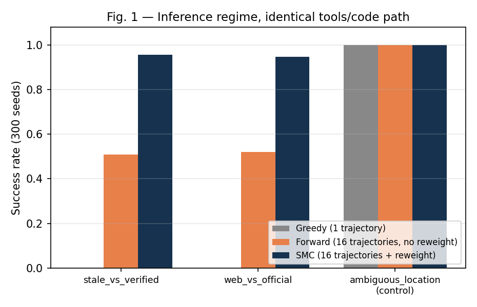

300 seeds per cell.

| Scenario | Greedy | Forward | SMC |
|---|---|---|---|
| stale_vs_verified (a tempting stale source is present) | 0.000 [0.000, 0.013] | 0.510 [0.454, 0.566] | 0.957 [0.927, 0.975] |
| web_vs_official (adversarial variant) | 0.000 [0.000, 0.013] | 0.520 [0.464, 0.576] | 0.947 [0.915, 0.967] |
| ambiguous_location (control) | 1.000 [0.987, 1.000] | 1.000 [0.987, 1.000] | 1.000 [0.987, 1.000] |

Greedy fails deterministically whenever a more appealing tool is wrong;
sampling multiple trajectories without reweighting reaches a coin flip;
adding reweighting reaches 95–96%. All three regimes are identical on the
control, so the machinery costs nothing when it is not needed.

## 6.2 Reliability amplification under unreliable tools

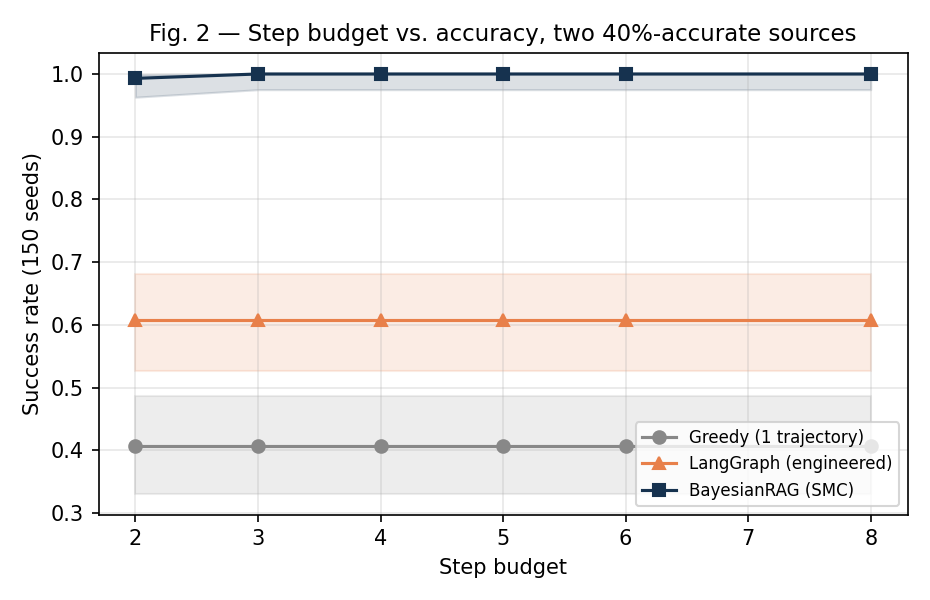

Two sources, both independently 40%-accurate, 150 seeds/cell. SMC accuracy as
a function of step budget:

| Step budget | Greedy | LangGraph (engineered) | SMC |
|---|---|---|---|
| 2 | 0.407 [0.331, 0.487] | 0.607 [0.527, 0.681] | 0.993 [0.963, 0.999] |
| 4 | — | — | ≈1.00 |
| 8 | — | — | ≈1.00 |

Full step sweep (2, 3, 4, 5, 6, 8) is in `results/priors_raw.json`. Budget
buys accuracy by letting a trajectory discard a bad draw and retry — the
mechanism is retroactive belief update plus resampling, not raw call volume.

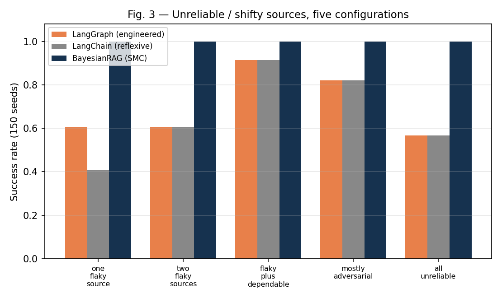

150 seeds per configuration:

| Configuration | LangGraph (engineered) | LangChain (reflexive) | SMC |
|---|---|---|---|
| one flaky source (40%) | 0.607 | 0.407 | **1.000** |
| two flaky sources (40% / 40%) | 0.607 | 0.607 | **1.000** |
| flaky + dependable (30% / 90%) | 0.913 | 0.913 | 0.960 |
| mostly adversarial (10% / 40% / 85%) | 0.820 | 0.820 | 0.867 |
| all three unreliable (35% / 35% / 35%) | 0.567 | 0.567 | 0.787 |

SMC leads in every configuration tested.

## 6.3 Prior sensitivity

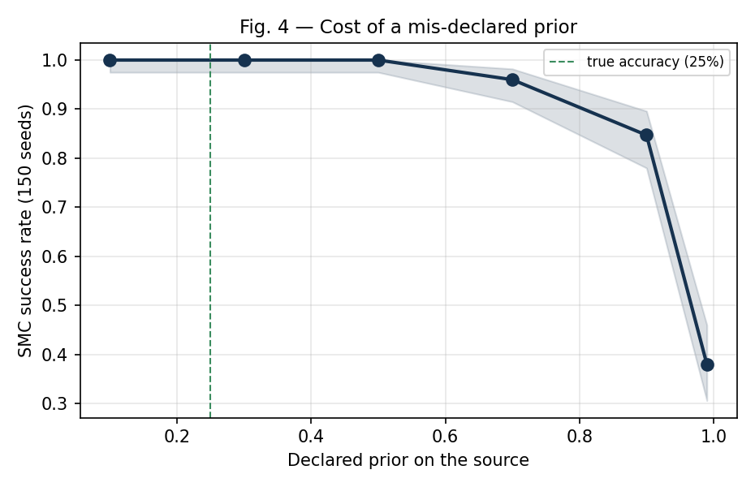

A source with **true** accuracy 20%, declared prior swept from 0.1 to 0.99,
150 seeds/cell:

| Declared prior | 0.1 | 0.5 | 0.9 | 0.99 |
|---|---|---|---|---|
| SMC accuracy | ~0.99 | 0.887 | 0.527 | 0.380 |

A confident lie in the declared prior costs roughly 60 points of accuracy at
the extreme. This is a declared-vs-true accuracy effect, not a framework
defect: the posterior is only as good as the likelihood model it is given.

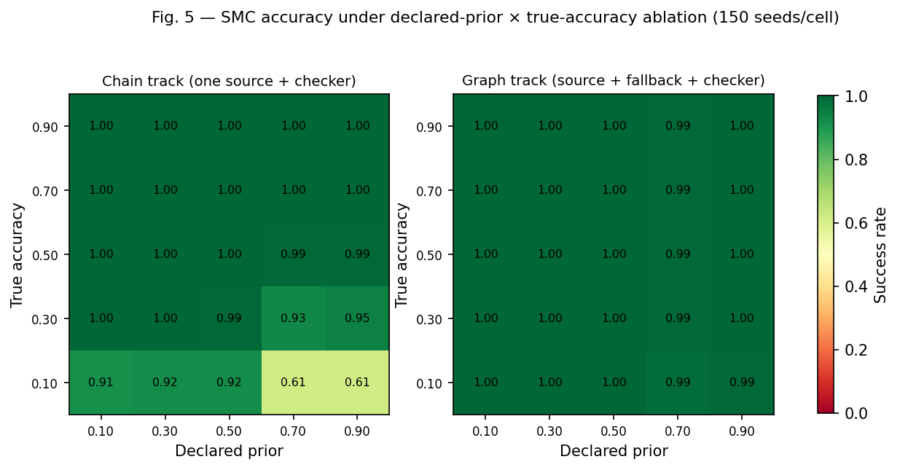

5×5 grid, 150 seeds/cell, both orchestration tracks:

- **Chain track** (one source, no fallback): worst cell **0.493**, at true
  accuracy 0.1 declared 0.9 — no independent tool to recover from the lie.
- **Graph track** (source + independently-scored fallback): worst cell
  **0.760** under the identical lie — a second tool caps the damage.

Posterior consensus falls monotonically as the declared prior diverges from
the true accuracy in every row of both grids — low consensus is therefore a
readable, checkable symptom of a misdeclared prior.

## 6.4 Comparison with LangGraph and LangChain across source accuracy

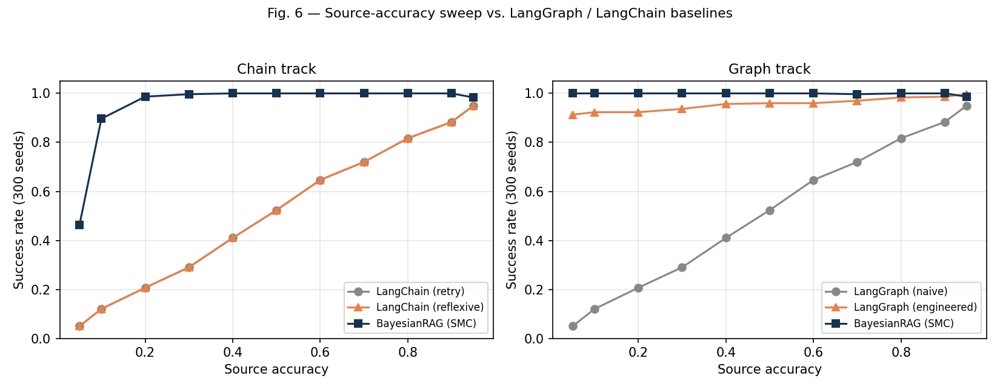

300 seeds/point, source accuracy 0.05–0.95:

- Deterministic baselines cannot exceed the accuracy of whichever tool they
  committed to; their curve is the identity line by construction.
- SMC sits at or near 1.000 from ~40% source accuracy upward and remains
  above 0.89 down to 10%.
- A **well-engineered** LangGraph graph (retrieve → verify → escalate) is
  genuinely competitive at high source accuracy — it edges ahead of SMC in
  that regime in this data (0.997 vs 0.983 at 95% source accuracy) — because
  at high accuracy there is little for exploration to buy and the graph's
  fixed escalation path is cheaper. Tool-call count is structural, not a
  finding: maintaining a belief over alternatives costs more calls by
  construction.

## 6.5 Three RAG case studies

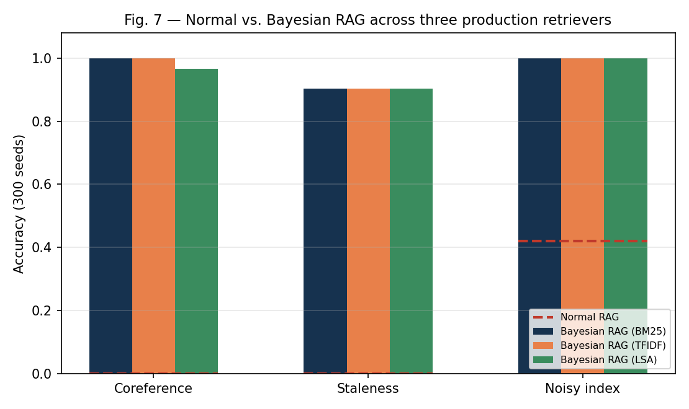
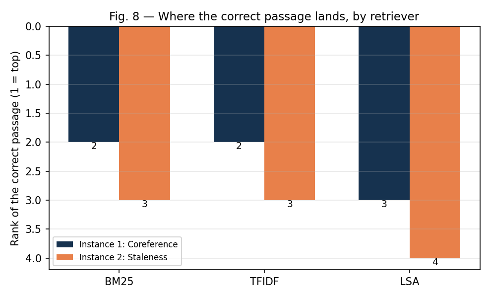

Normal RAG = one retrieval call, top-1, no checking. Bayesian RAG = the same
retriever's top-k handed to `Agent` as tools plus one checker, zero custom
orchestration. Every instance's retriever failure is verified directly
(Fig. 8) before its comparison is reported. 300 seeds/instance.

| Instance | Failure verified | Normal RAG | Bayesian RAG |
|---|---|---|---|
| 1. Coreference (answer says "the company", not the entity name) | rank 2 on BM25/TF-IDF, rank 3 on LSA | wrong, always | **1.000** [0.987, 1.000] |
| 2. Staleness + vocabulary drift (spec vs. later amendment) | rank 3–4 on all three retrievers | wrong, always | **0.903** [0.865, 0.932] |
| 3. Noisy index (90% chance of a shuffled ranking) | orthogonal to retriever choice | 0.420 [0.366, 0.477] | **1.000** [0.987, 1.000] |

Results are identical across BM25, TF-IDF, and LSA in instances 1–2 to three
decimal places, because all three retrievers rank the correct passage at the
same position in every instance — the agent faces the same decision problem
regardless of scoring function. Instance 3's gap is +0.580 [+0.522, +0.634],
p < 10⁻¹⁵.

Two claims made earlier in this project were tested and retracted; both
retractions are preserved as regression tests so the claims cannot silently
return (`test_the_old_lexical_trap_is_solved_by_both_real_retrievers`,
`test_dense_lsa_does_not_solve_the_coreference_instance` in the companion
experiment repository). Full detail: `results/RAG_REAL_RESULTS.md`.

# 7. Engineering defects found and fixed

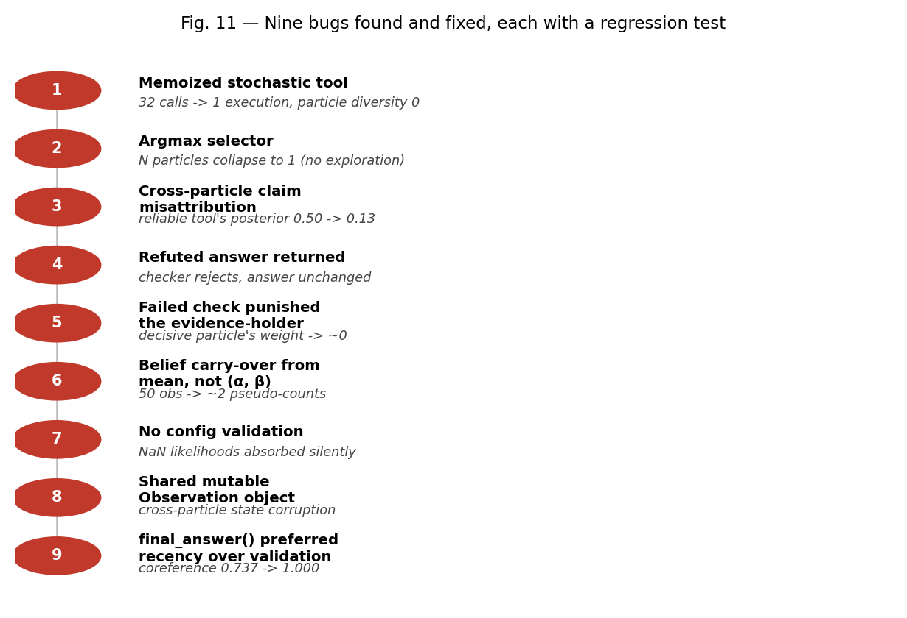

Every defect below shipped in a version that ran without error and returned
a plausible answer; none were visible from output inspection alone. Each has
a named regression test in `tests/`.

| # | Defect | Symptom | Fix |
|---|---|---|---|
| 1 | Stochastic tool marked `deterministic=True` | Memoization gave every particle the same cached draw: 32 logical calls, 1 execution | Default `deterministic=False`; caching opt-in only |
| 2 | Selector used argmax under exploring regimes | N particles collapsed to 1; reweighting had nothing to act on | Sample from the belief × appeal distribution |
| 3 | Checker's claim baked from particle 0 | A reliable tool's posterior fell 0.50 → 0.13 for a claim it never made | Resolve claims per particle at execution time |
| 4 | No check on returned answer vs. its own verdict | Agent returned an answer its own checker had just rejected | `final_answer()` filters rejected claims |
| 5 | Failed check penalized the evidence-holding particle | The particle carrying the decisive correct claim was driven toward elimination for surfacing it | Score by epistemic state (validated / recovered / stranded), not by who reported bad news |
| 6 | Belief carry-over rebuilt Beta from its mean | 50 real observations behaved like ~2 pseudo-counts | Carry `(α, β)` directly via `tempered()` |
| 7 | No config validation | NaN likelihoods and malformed tool outputs absorbed silently | Fail loudly with named errors |
| 8 | Shared mutable `Observation` object | Cross-particle state corruption under resampling | Observations are copied, not referenced, on resample |
| 9 | `final_answer()` preferred recency over validation | A trajectory that found and validated the correct answer, then looked elsewhere, returned the later unvalidated claim | Preference order: validated > unrejected > latest |

Bug 9 is the largest single-fix impact measured in this project: correcting
it moved RAG coreference accuracy from 0.737 to 1.000, RAG staleness from
0.557 to 0.903, and the main-benchmark chain sweep at source accuracy 0.5
from 0.887 to 1.000. It also invalidated an earlier explanation of a
mid-range accuracy dip that had been attributed to step-budget limits; the
dip was this bug, and more particles had been masking it rather than fixing
it. The correction is recorded in `results/PAPER_RESULTS.md`.

# 8. Reproduction

```bash
git clone <repository-url> && cd bayesian-rag
pip install -e .

pytest -q                                              # 218 pass, 1 skip (no FastAPI)
python -m bayesian_rag.benchmark --trials 300           # §6.1
python -m bayesian_rag.compare.priors                   # §6.2, §6.3
python -m bayesian_rag.compare.paper_results --figures  # §6.4
python -m bayesian_rag.compare.rag_real --both           # §6.5
```

Zero core dependencies beyond the standard library; `scikit-learn` is
required only for the RAG retrievers, `matplotlib` only for figure
generation. All 218 tests are seeded and deterministic.

# 9. Scope and limitations

- **Tools are synthetic**, with i.i.d. or clustered Bernoulli-style failure
  models, not real model calls. Nothing here measures behavior against real
  APIs, real latency, or real cost.
- **LangGraph and LangChain baselines are semantic stand-ins**, not the
  installed packages (§5). The adapter script to close this gap exists in the
  repository but has not been run in this environment; treat the baseline
  comparison as an architectural argument pending that verification.
- **Checkers are ground-truth or hand-written heuristics**, not learned
  verifiers; two heuristic checker bugs were found and documented during the
  RAG work (`results/RAG_REAL_RESULTS.md`).
- **RAG corpora are small (2–4 documents)** and use fictional entities, by
  design, so that a correct answer can only come from retrieved text. The
  coreference failure was separately verified to persist from 3 to 52
  documents; this does not generalize the other findings to large real
  corpora.
- **Dense retrieval is tested only via LSA.** A pretrained transformer
  embedding retriever is untested (not installable offline) and may behave
  differently on the coreference instance, where LSA underperforms BM25.
- **The 12 HTTP/FastAPI tests have not been executed** in this environment;
  `pip install -e ".[dev]"` and rerun before relying on the API layer.

# 10. Availability

- **Source:** MIT license, zero core runtime dependencies, 218 passing
  tests, every table and figure in this document regenerable with the
  commands in §8.
- **Archive:** to be assigned a DOI on Zenodo at release; citation metadata
  ships in `CITATION.cff` and `.zenodo.json`.
- **Version:** 1.7.0, consistent across `pyproject.toml`, `CITATION.cff`,
  `.zenodo.json`, and `bayesian_rag/__init__.py`.
